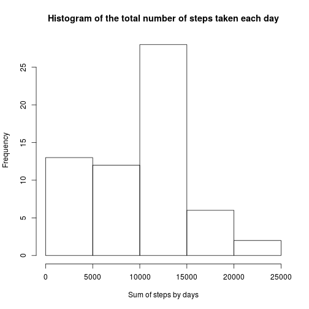
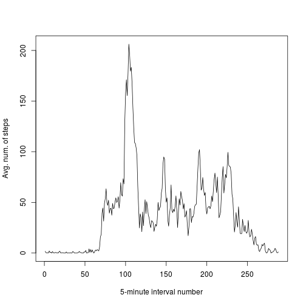
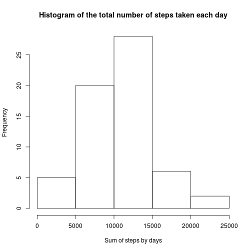
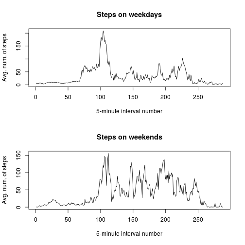

## Loading and preprocessing the data

The GitHub repository also contains the dataset for the assignment so you do not have to download the data separately.

First, we need to set locale

```r
Sys.setlocale("LC_TIME", "C")
```

```
## [1] "C"
```


### Loading data

So we just unzip it and read into the data frame

```r
unzip(zipfile = "activity.zip", files = "activity.csv")
data <- read.csv(file = "activity.csv", na.strings = "NA")
```

Let's make some assertions

```r
assertthat::are_equal(nrow(data), 17568) # As given in task
```

```
## [1] TRUE
```

```r
assertthat::are_equal(ncol(data), 3) # As given in task
```

```
## [1] TRUE
```

Let's have a look at the data

```r
colnames(data)
```

```
## [1] "steps"    "date"     "interval"
```

```r
head(data)
```

```
##   steps       date interval
## 1    NA 2012-10-01        0
## 2    NA 2012-10-01        5
## 3    NA 2012-10-01       10
## 4    NA 2012-10-01       15
## 5    NA 2012-10-01       20
## 6    NA 2012-10-01       25
```

```r
tail(data)
```

```
##       steps       date interval
## 17563    NA 2012-11-30     2330
## 17564    NA 2012-11-30     2335
## 17565    NA 2012-11-30     2340
## 17566    NA 2012-11-30     2345
## 17567    NA 2012-11-30     2350
## 17568    NA 2012-11-30     2355
```

### Process/transform the data (if necessary) into a format suitable for your analysis


```r
data = transform(data, date = as.Date(date))

library(data.table)
```

```
## data.table 1.9.4  For help type: ?data.table
## *** NB: by=.EACHI is now explicit. See README to restore previous behaviour.
```

```r
datt <- data.table(data)
```

## What is mean total number of steps taken per day?

Missing values are ignored.

### Make a histogram of the total number of steps taken each day

```r
sum_by_days <- datt[, sum(steps, na.rm = TRUE), by = date]$V1
hist(sum_by_days,
     main = "Histogram of the total number of steps taken each day",
     xlab = "Sum of steps by days",
     ylab = "Frequency")
```

 

### Calculate and report the mean and median total number of steps taken per day

```r
mean(sum_by_days)
```

```
## [1] 9354.23
```

```r
median(sum_by_days)
```

```
## [1] 10395
```

## What is the average daily activity pattern?

### Make a time series plot (i.e. type = "l") of the 5-minute interval (x-axis) and the average number of steps taken, averaged across all days (y-axis)

Again, ignoring missing values


```r
datt$interval_num = datt$interval/5 %% 288
datt_grouped_by_int_avg_steps <- datt[, mean(steps, na.rm = TRUE),
                                     by = interval_num]$V1
plot(1:288, datt_grouped_by_int_avg_steps,
     type = "l", xlab = "5-minute interval number",
     ylab = "Avg. num. of steps")
```

 

### Which 5-minute interval, on average across all the days in the dataset, contains the maximum number of steps?

```r
which.max(datt_grouped_by_int_avg_steps)
```

```
## [1] 104
```

## Imputing missing values

### Calculate and report the total number of missing values in the dataset (i.e. the total number of rows with NAs)


```r
sum(!complete.cases(datt))
```

```
## [1] 2304
```

### Devise a strategy for filling in all of the missing values in the dataset. The strategy does not need to be sophisticated. For example, you could use the mean/median for that day, or the mean for that 5-minute interval, etc.

Let's use the mean for that 5-minute interval! (But as my research resulted, we'll still get some NAs) there. If this happens, we'll use 0

### Create a new dataset that is equal to the original dataset but with the missing data filled in.


```r
datt$complete_steps <- ifelse(is.na(datt$steps),
                         ifelse(is.na(
                             datt_grouped_by_int_avg_steps[datt$interval_num]),
                             0,
                             datt_grouped_by_int_avg_steps[datt$interval_num]),
                         datt$steps)
newdatt <- datt[, c("complete_steps", "date", "interval", "interval_num"), with = FALSE]
head(newdatt)
```

```
##    complete_steps       date interval interval_num
## 1:      1.7169811 2012-10-01        0            0
## 2:      0.3396226 2012-10-01        5            1
## 3:      0.1320755 2012-10-01       10            2
## 4:      0.1509434 2012-10-01       15            3
## 5:      0.0754717 2012-10-01       20            4
## 6:      2.0943396 2012-10-01       25            5
```

```r
sum(complete.cases(newdatt)) # Ensure now the data is complete
```

```
## [1] 17568
```

### Make a histogram of the total number of steps taken each day and Calculate and report the mean and median total number of steps taken per day. Do these values differ from the estimates from the first part of the assignment? What is the impact of imputing missing data on the estimates of the total daily number of steps?


```r
new_sum_by_days <- newdatt[, sum(complete_steps), by = date]$V1
hist(new_sum_by_days,
     main = "Histogram of the total number of steps taken each day",
     xlab = "Sum of steps by days",
     ylab = "Frequency")
```

 

```r
mean(new_sum_by_days)
```

```
## [1] 10285.23
```

```r
median(new_sum_by_days)
```

```
## [1] 10395
```

So, the mean has increased, the median left as it was (because it's the robust estimate, I suppose).

## Are there differences in activity patterns between weekdays and weekends?


```r
weekday <- c("Mon", "Tue", "Wed", "Thu", "Fri")
weekend <- c("Sat", "Sun")
```

### Create a new factor variable in the dataset with two levels -- "weekday" and "weekend" indicating whether a given date is a weekday or weekend day.


```r
newdatt$dayss <- as.factor(ifelse(weekdays(as.Date(newdatt$date), abbreviate = TRUE) %in% weekend, "weekend", "weekday"))
```

### Make a panel plot containing a time series plot (i.e. type = "l") of the 5-minute interval (x-axis) and the average number of steps taken, averaged across all weekday days or weekend days (y-axis)


```r
weekdays_grouped_by_int_avg_steps <- newdatt[dayss == "weekday",
                                             mean(complete_steps, na.rm = TRUE),
                                             by = interval_num]$V1
weekends_grouped_by_int_avg_steps <- newdatt[dayss == "weekend",
                                             mean(complete_steps, na.rm = TRUE),
                                             by = interval_num]$V1
par(mfcol = c(2, 1))
plot(1:288, weekdays_grouped_by_int_avg_steps,
     type = "l", xlab = "5-minute interval number",
     ylab = "Avg. num. of steps", main = "Steps on weekdays")
plot(1:288, weekends_grouped_by_int_avg_steps,
     type = "l", xlab = "5-minute interval number",
     ylab = "Avg. num. of steps", main = "Steps on weekends")
```

 
